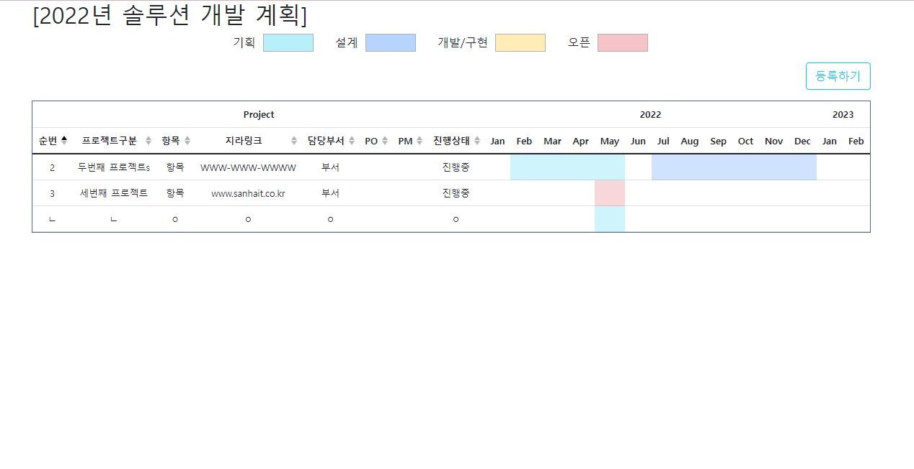
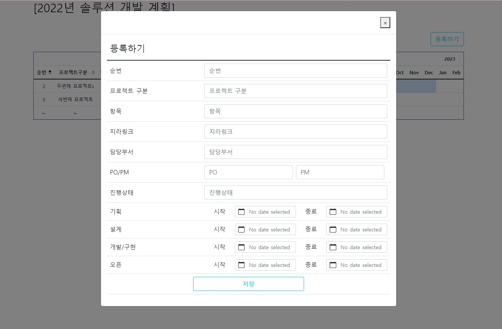
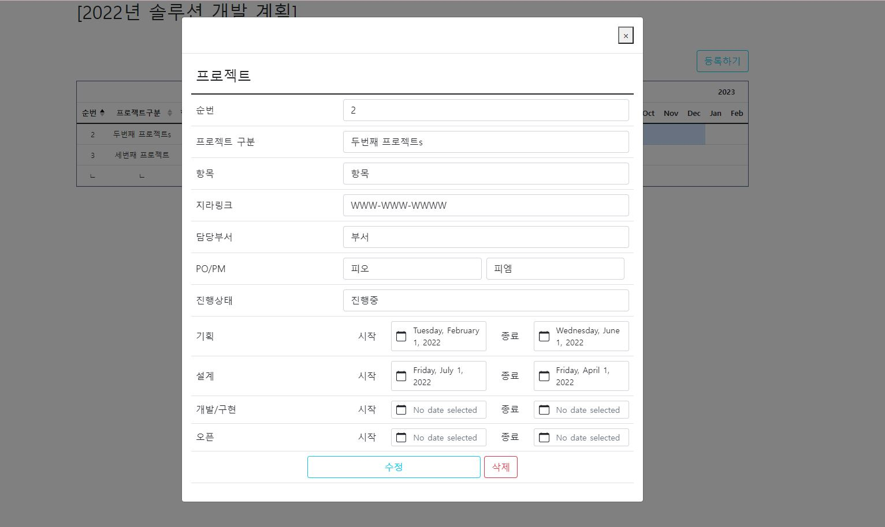

# b_pj_progressive_fe

### 2022-05-31
- 필수값 체크
> 순번 / 프로젝트구분 / 항목 / 지라링크 / 담당부서 / Product Owner / Product Manager / 진행상태 / 기획
- 유효성 체크
> 기획 → 설계 → 개발/구현 → 오픈 순서대로
- endDate 표에 추가
> 기획 / 설계 / 개발/구현 / 오픈  에서 가장 endDate를 표시
- 표 사이즈 고정
> table scroll 기능

### 화면

